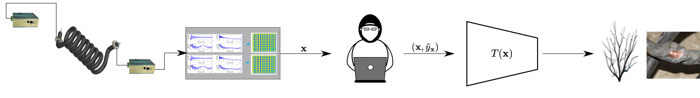

  
# Data-Driven Grid Monitoring Under Label Noise Using Power Line Modems

[Nicola Novello](https://scholar.google.com/citations?user=4PPM0GkAAAAJ&hl=en), [Dong Liang](https://ieeexplore.ieee.org/author/37086818468), and [Andrea M. Tonello](https://scholar.google.com/citations?user=qBiseEsAAAAJ&hl=en)

Official repository of the paper "Data-Driven Grid Monitoring Under Label Noise Using Power Line Modems" published at IEEE International Conference on Communications, Control, and Computing Technologies for Smart Grids (SmartGridComm) 2025.

> Novel approach to deal with label noise for fault detection applications. Based on a recently proposed f-divergece-based class of objective functions.

---
# 📷 Scenario

---

# 💻 How to run the code

Coming soon...

---

## 📝 References

Coming soon...

---

## 📋 Acknowledgments

The implementation is based on / inspired by:

- [https://github.com/nicolaNovello/discriminative-classification-fDiv](https://github.com/nicolaNovello/discriminative-classification-fDiv)

---

## 📧 Contact

[nicola.novello@aau.at](nicola.novello@aau.at)
